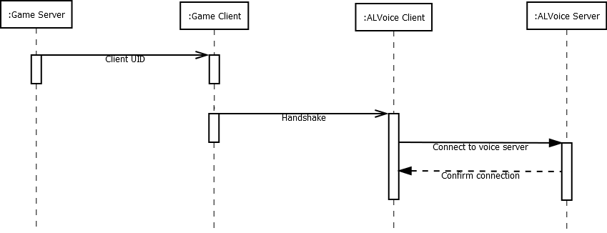

# ALVoice communication

## Definitions

 * ALVoice Client: The Teamspeak 3 plugin which controls the local teamspeak
 * ALVoice Server: The server instance which controls the teamspeak plugin instances
 * Game Client: The actual game running on the users PC 
 * Game Server: The multiplayer server for the actual game

## General idea

The ALVoice teamspeak plugin is the *main component*. It un-/mutes teamspeak clients and changes their volume and positional audio. The needed information is send by the *ALVoice server* to each *ALVoice client* which is controlled by the *game server*.
The *game client* only talks on connection setup with the *ALVoice client* to give *ALVoice client* about the *ALVoice server* and unique client identifier.

## Connection setup

When the *game client* connects to the *game server* the server tells the client about the needed information (endpoint, client unique identifier) to connect to the *ALVoice server*. The *game client* then sends this information (via the local connection) to the *ALVoice client*. The *ALVoice client* now has all information needed to connect the specific *ALVoice server* which belongs to the *game server*. The *ALVoice client* connects to the *ALVoice server* and the server confirms the connection. With the confirmation the connection setup is **completed**.

