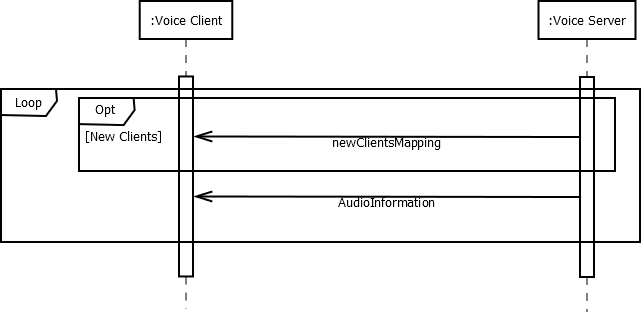

# JustAnotherVoiceChat communication

## Definitions

 * JustAnotherVoiceChat Client: The Teamspeak 3 plugin which controls the local teamspeak
 * JustAnotherVoiceChat Server: The server instance which controls the teamspeak plugin instances
 * Game Client: The actual game running on the users PC 
 * Game Server: The multiplayer server for the actual game

## General idea

The JustAnotherVoiceChat teamspeak plugin is the *main component*. It un-/mutes teamspeak clients and changes their volume and positional audio. The needed information is send by the *JustAnotherVoiceChat Server* to each *JustAnotherVoiceChat client* which is controlled by the *game server*.
The *game client* only talks on connection setup with the *JustAnotherVoiceChat client* to give *JustAnotherVoiceChat client* about the *JustAnotherVoiceChat server* and unique client identifier.

## Connection setup

When the *game client* connects to the *game server* the server tells the client about the needed information (endpoint, client unique identifier) to connect to the *JustAnotherVoiceChat server*. The *game client* then sends this information (via the local connection) to the *JustAnotherVoiceChat client*. The *JustAnotherVoiceChat client* now has all information needed to connect the specific *JustAnotherVoiceChat server* which belongs to the *game server*. The *JustAnotherVoiceChat client* connects to the *JustAnotherVoiceChat server* and the server confirms the connection. When the connection was confirmed the client requests the client uid to teamspeak id mapping it needs to change teamspeak clients. With this information the connection setup is **completed**.

## Continues updates

When the *JustAnotherVoiceChat client* connection setup is completed it receives continues updates from the *JustAnotherVoiceChat server* about changed players. This is the **main message** the complete communication is about.

### updatePlayersMessage

The idea is to send as less information as possible but enough that the client can change the needed teamspeak clients. Information required to change a single clients is:

 * Player is in range to be heard
 * Range to the player to set volume modifier
 * Stereo position of the player to set audio pan
